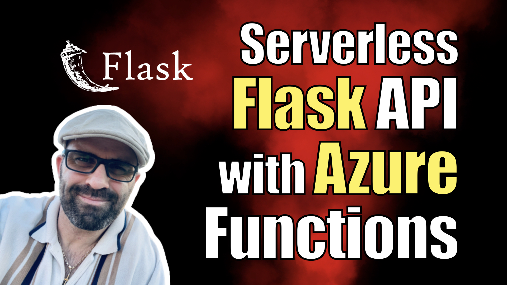

# Serverless Flask API with Azure Functions

[ ](https://kalbartal.net/serverless-flask-api-with-azure-functions/)

I have a step by step walkthrough for this project on my [my blog](https://kalbartal.net/serverless-flask-api-with-azure-functions/).


This is a sample Flask API deployed as an Azure Function. The API provides a simple greeting endpoint that accepts a name in the request body and responds with a personalized greeting message.

## Requirements
- Python 3.6 or higher
- Azure Functions Core Tools (for local development)

## Getting started
1. Clone this repository and navigate to the project directory.
2. Create a virtual environment using `python3 -m venv venv`.
3. Activate the virtual environment using `source venv/bin/activate` (on macOS/Linux) or `.\venv\Scripts\activate` (on Windows).
4. Install the required packages using `pip install -r requirements.txt`.
5. Start the development server using `func start`.

## Deploying to Azure Functions
1. Create a new Azure Function App in the Azure portal.
2. Deploy the Flask API by following the steps in the [official Azure Functions documentation](https://docs.microsoft.com/en-us/azure/azure-functions/functions-create-first-function-python).

## API documentation
The Flask API provides the following endpoint:

- `/api/greet` (POST)
    - Accepts a JSON request body containing a `name` parameter and returns a personalized greeting message.
    ###### Request
    ```json
    {
        "name": "John"
    }
    ```
    ###### Response
    ```json
    {
        "message": "Hello, John!"
    }
    ```

## License
This project is licensed under the MIT License - see the [LICENSE](./LICENSE) file for details.
